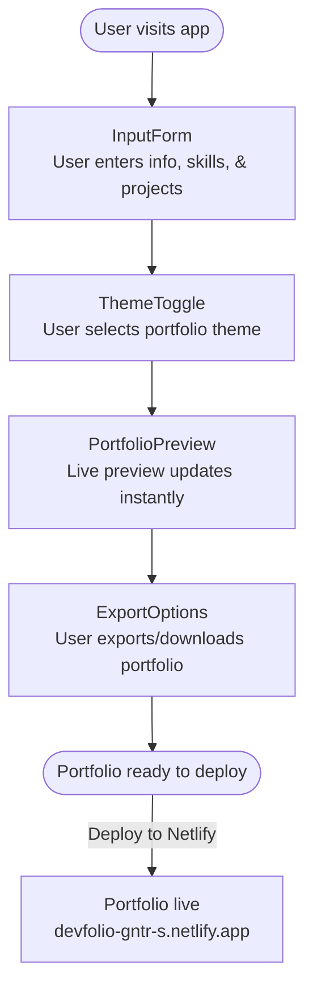

# Dev Portfolio Generator

A dynamic web app for generating beautiful, customizable developer portfolios with zero coding! Just input your details, select projects, pick a theme, and instantly preview and export a ready-to-deploy portfolio.

🌐 **Live Demo:** [devfolio-gntr-s.netlify.app](https://devfolio-gntr-s.netlify.app)

---

## 🗺️ Workflow Diagram



---

## 📂 Project Structure

A detailed overview of the files and folders in this repository:

```
public/
└── favicon.png

src/
├── assets/
│   └── react.svg
│
├── components/
│   ├── ExportOptions.jsx         # Export/download portfolio functionality
│   ├── Footer.jsx                # App footer
│   ├── InputForm.jsx             # Main user input form
│   ├── PortfolioPreview.jsx      # Live portfolio preview
│   ├── ProjectForm.jsx           # Add/edit project entries
│   └── ThemeToggle.jsx           # Light/dark mode toggle
│
├── data/
│   └── defaultUserData.js        # Default form/user data
│
├── styles/
│   ├── App.css                   # Main app styles
│   └── index.css                 # Global styles
│
├── App.jsx                       # Root component
├── main.jsx                      # App entry point
```

---

## ✨ Features

- **Interactive Input Form:** Fill in your personal information, skills, and projects.
- **Live Portfolio Preview:** Instantly see your portfolio as you edit.
- **Export Options:** Download or export your portfolio, ready to host anywhere.
- **Theme Support:** Toggle between light and dark modes.
- **Responsive Design:** Looks great on all devices.
- **No Coding Required:** Simple, user-friendly interface.

---

## 🛠️ Tech Stack

- **Frontend:** React.js (Vite)
- **Styling:** CSS Modules
- **Deployment:** Netlify

---

## 🚀 Getting Started

### 1. Clone

```bash
git clone https://github.com/sinha-19/Dev-Portfolio-Generator.git
cd Dev-Portfolio-Generator
```

### 2. Install Dependencies

```bash
npm install
```

### 3. Run Locally

```bash
npm run dev
```

Visit [http://localhost:5173](http://localhost:5173) in your browser.

### 4. Build for Production

```bash
npm run build
```

---

## 📦 Deployment

This app is continuously deployed to Netlify.

- **Live site:** [https://devfolio-gntr-s.netlify.app](https://devfolio-gntr-s.netlify.app)

To deploy your own version:

1. Push your code to GitHub.
2. Connect your repo to [Netlify](https://www.netlify.com/).
3. Set the build command to `npm run build` and the publish directory to `dist`.

---

## 🙌 Contributing

Pull requests and suggestions are welcome! Please fork the repo and submit your PR.

---

## 📄 License

MIT

---

## 👤 Author

- [sinha-19](https://github.com/sinha-19)
